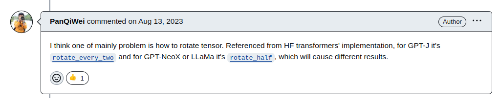

# RoPE triton Implementation
* triton library를 사용하여 RoPE kernel을 구현하는 코드
* [RoPE arxiv](https://arxiv.org/abs/2104.09864)
* [transformer_engine](https://github.com/NVIDIA/TransformerEngine)
* [triton](https://github.com/openai/triton)

### Installation
nvidia에서 제공하는 23.10 이후 pytorch docker 환경에는 transformer_engine과 flatten_atten 패키지가 같이 내장되어 있습니다.

그러나 가장 최신 이미지인 24.02-py3를 사용함에도 불구하고 transformer_engine 패키지가 1.3 버전으로 rotary positional encoding의 cuda kernel이 구현되어 있지 않은 버전입니다.

transformer_engine을 새로운 버전으로 설치하려 하였으나 RAM 32g에서도 OOM 현상이 발생하여 패키지 빌드가 되지 않는 문제가 있어, cuda kernel 함수와의 비교가 어려워 pytorch 구현 버전으로 성능 비교를 하였습니다.

---

**Computation Environment**
* Intel i9-13900K
* RTX 3090
* 32g RAM
* ubuntu 22.04

---

```bash
docker run --gpus all -it --rm --name ai_compiler nvcr.io/nvidia/pytorch:24.02-py3
git clone https://github.com/han811/AI_Compiler.git
cd AI_Compiler
python3 main.py
```
위의 과정을 통해 실행하면, pytorch RoPE와 triton 구현 버전의 RoPE 비교가 가능합니다.

### How it works
다음의 transformer_engine의 [RoPE 구현 코드](https://github.com/NVIDIA/TransformerEngine/blob/b8eea8aaa94bb566c3a12384eda064bda8ac4fd7/transformer_engine/pytorch/attention.py#L1170-L1230)를 보면 [cos을 곱할 영역과 sin을 곱할 영역을 구분하는 코드](https://github.com/NVIDIA/TransformerEngine/blob/b8eea8aaa94bb566c3a12384eda064bda8ac4fd7/transformer_engine/pytorch/attention.py#L1161)가 있습니다.  
이를 기반으로 같은 결과물을 만들도록 triton code를 작성하였으며, 입력 형태가 (seq_len, batch_size, num_head, head_dim)의 tensor를 받도록 하였습니다.  
여기서 RoPE가 적용되려면 head_dim 축의 모든 feature들이 필요로 함으로 block의 크기를 head_dim과 같도록 설정하였고, 나머지 축들은 곱셈으로 다 합쳐서 하나의 축이 되도록 grid를 설정하여 병렬연산을 하도록 하였습니다.

### Result

  
위의 결과를 보면 triton kernel로 구현한 코드가 더 빠른 시간 안에 RoPE 연산을 수행하는 것을 볼 수 있습니다.  
이를 통해 pytorch로 naive하게 (fused=False 옵션) 구현한 코드보다 gpu에서 병렬로 연산하도록 kernel로 구현한 triton이 더 빠름을 알 수 있습니다.

### Suspicious Point
RoPE를 구현하는 과정에서 transformer_engine의 RoPE가 잘못 구현하였다고 생각되었던 부분이 있습니다.  
  
위의 수식은 RoPE의 implementation 방법에 대한 수식 부분 입니다.  
이처럼 cos term은 순서대로 head feature를 사용하지만 sin term은 even term과 odd term을 번갈아가며 연산하여야 옳은 계산이라고 볼 수 있습니다.  
그러나 transformer_engine 및 이를 기반으로 똑같이 구현한 저의 코드는 아래의 수식과 같다고 이해됩니다.  
  
이러한 의문을 가지고 찾아보던중 비슷한 의문을 가지는 [링크](https://github.com/vllm-project/vllm/issues/747)를 찾을 수 있었습니다.  

또한, huggingface의 [GPT-J](https://github.com/huggingface/transformers/blob/fe3c8ab1af558b95f67f5fafc0c55f09fd2b09db/src/transformers/models/gptj/modeling_gptj.py#L69) 및 [GPT-NEOX](https://github.com/huggingface/transformers/blob/fe3c8ab1af558b95f67f5fafc0c55f09fd2b09db/src/transformers/models/gpt_neox/modeling_gpt_neox.py#L368)의 RoPE 구현을 보면 둘의 구현이 다름을 알 수 있습니다.  
위의 issue 링크에서는 GPT-NEOX의 구현이 맞는 것으로 결론을 내리고, 위의 실제 RoPE의 구현을 수식으로 풀어보니 논문에서는 (x_1,x_2) , (x_3,x_4) ... 등으로 pair를 짓지만 half_rotate 방식으로 RoPE를 구현한 코드는 (x_1,x_(d/2)) , (x_2,x_(d/2+1)) ... 등으로 pair가 이루어져 결국 seq에서 멀리 있을 수록 attention score가 적게 들어가는 영향을 똑같이 줌을 알 수 있었습니다.  
실제로 transformer_engine의 [positional_embedding 부분의 freq 생성 부분](https://github.com/NVIDIA/TransformerEngine/blob/main/transformer_engine/pytorch/attention.py#L1077)을 보니 논문의 수식처럼 cos, sin이 붙어서 생성되는 것이 아니라 [ $m\theta_1,m\theta_2,...,m\theta_{d/2},m\theta_1,m\theta_2,...,m\theta_{d/2}$ ]와 같은 형태로 붙어 있어 rotation matrix가 형성됨을 볼 수 있었습니다. (결국 half rotate하는 방식이 맞았습니다.)


